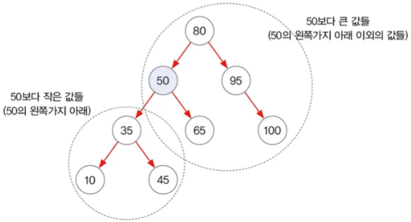
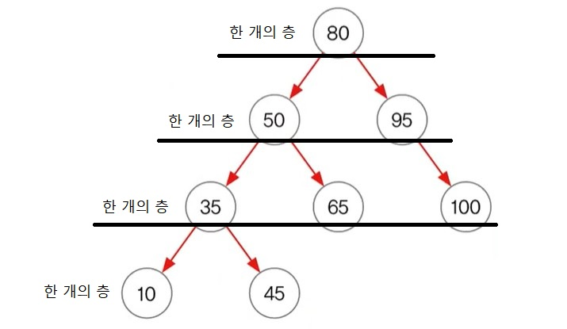

# Collections Framework

> - 컬렉션(Collections) : 여러 객체(데이터)를 모아 놓은 것.
> - 프레임웍(Framework) : 라이브러리(기능) + 프로그래밍 방식을 표준화, 정형화.
> - 컬렉션 프레임웍(Collections Framework) : 여러 객체를 다루기 위한 표준화된 프로그래밍 방식.

> - 컬렉션 프레임웍의 핵심 인터페이스(컬렉션을 3종류로 구분한 것).
> - Collection : List와 Set의 공통 부분으로 만든 인터페이스. List와 Set의 조상 인터페이스.
>
> |   | 저장 순서 | 중복 허용 | EX |
> |:---:|:---:|:---:|:---:|
> | List | o | o | 대기자 명단 |
> | Set | x | x | 동물의 집합 |
> | Map | x | key : x / value : o | ID, PASSWORD |

___

## ArrayList

> | 생성자 |
> |:----:|
> | ArrayList() |
> | ArrayList(Collection c) |
> | ArrayList(int initialCapacity) |

<br>

> | 메서드 |
> |:----:|
> | boolean ***add(Object o)*** |
> | void ***add(int index, Object element)*** |
> | boolean ***addAll(Collection c)*** |
> | boolean ***addAll(int index, Collection c)*** |

<br>

> | 메서드 |
> |:----:|
> | boolean ***remove(Object o)*** |
> | Object ***remove(int index)*** |
> | boolean ***removeAll(Collection c)*** |
> | void ***clear()*** |

<br>

> | 메서드 |
> |:----:|
> | int ***indexOf(Object o)*** |
> | int ***lastIndexOf(Object o)*** |
> | boolean ***contains(Object o)*** |
> | Object ***get(int index)*** |
> | Object ***set(int index, Object element)*** |

<br>

> | 메서드 |
> |:----:|
> | List ***subList(int fromIndex, int toIndex)*** |
> | Object[] ***toArray()*** |
> | Object[] ***toArray(Object[] a)*** |
> | boolean ***isEmpty()*** |
> | void ***trimToSize()*** |
> | int ***size()*** |

___

## Stack
> 
> | 메서드 |
> |:----:|
> | boolean ***empty()*** |
> | Object ***peek()*** |
> | Object ***pop()*** |
> | Object ***push(Object item)*** |
> | int ***search(Object o)*** |

<br>

## Queue
> 
> | 메서드 |
> |:----:|
> | boolean ***add(Object o)*** |
> | Object ***remove()*** |
> | Object ***element()*** |
> | boolean ***offer(Object o)*** |
> | Object ***poll()*** |
> | Object ***peek()*** |

___

## Iterator
> - 컬렉션에 저장된 데이터를 접근하는데(읽어오는데) 사용되는 인터페이스.
> 
> | 메서드 | 특징 |
> |:----:|:----:|
> | boolean ***hasNext()*** | 읽어 올 요소가 남아있는지 확인 |
> | Object ***next()*** | 다음 요소를 읽어 옴 |

<br>

## Enumeration
> - Iterator의 old 버전.
> 
> | 메서드 | 특징 |
> |:----:|:----:|
> | boolean ***hasMoreElements()*** | Iterator의 hasNext()와 동일 |
> | Object ***nextElement()*** | Iterator의 next()와 동일함 |

<br>

## Iterator 사용법
> > - Collection 인터페이스에 정의된 iterator() 메서드를 호출해서 사용.
> > - iterator()는 일회용이라서 한번 쓰고 나면 다시 얻어와야 함.
> > 
> > ```java
> > public interface Collection {
> >           ...
> >     Iterator iterator();
> >           ...
> > }
> > ```
> > 
> > ```java
> > Collection c = new ArrayList();
> > // Collection c = new HashSet();
> > Iterator it = c.iterator();
> > 
> > while (it.hasNext()) {
>	>   ...
>	>     it.next();
> >   ...
> > }
> > ```
>
> > - Map에는 iterator() 메서드가 없는데 사용하려면?
> > - keySet(), entrySet(), values() 메서드를 호출해서 Set으로 변환 후 사용.
> > ```java
> > Map map = new HashMap();
> >   ...
>	> Iterator it = map.entrySet().iterator();
> >   ...
> > ```

___

## HashSet
> - 일반적으로 Set을 사용하고 싶다면 HashSet 클래스를 사용하면 됨.
> - 순서를 유지하고 싶으면, LinkedHashSet 클래스를 사용하면 됨.
> - Set은 순서 유지가 안 되므로 정렬 불가.
>   - 정렬하기 위해서는 List로 변경해야 함.

> | 생성자 |
> |:-----:|
> | HashSet() |
> | HashSet(Collection c) |
> | HashSet(int initialCapacity) |
> | HashSet(int initialCapacity, float loadFactor) |

> | 메서드 |
> |:-----:|
> | boolean ***add(Object o)*** |
> | boolean ***addAll(Collection c)*** |
> | boolean ***remove(Object o)*** |
> | boolean ***removeAll(Collection c)*** |
> | boolean ***retainAll(Collection c)*** |
> | void ***clear()*** |

> | 메서드 |
> |:-----:|
> | boolean ***contains(Object o)*** |
> | boolean ***containsAll(Collection c)*** |
> | Iterator ***iterator()*** |

> | 메서드 |
> |:-----:|
> | boolean ***isEmpty()*** |
> | int ***size()*** |
> | Object[] ***toArray()*** |
> | Object[] ***toArray(Object[] a)*** |

<br>

> - HashSet은 객체를 저장하기 전에 같은 객체가 이미 저장되어 있는지 확인.
>   - 같은 객체가 없으면 저장하고, 있으면 저장하지 않음.
> - boolean add(Object o) 메서드는 저장할 객체의 equals(), hashCode() 메서드를 호출.
>   - 반드시 equals(), hashCode() 메서드를 오버라이딩해야 함.
>   - 오버라이딩하지 않으면 올바로 작동하지 않음(중복된 객체를 확인하지 못함).
>   - hashCode() 메서드 오버라이딩하는 법.
>   ```java
>   class Person {
> 	    String name;
> 	    int age;
> 	  ...
> 	    public int hashCode() {
> 		    return (name+age).hashCode(); // 옛날 방법(문자열.hashCode())
> 		    return Objects.hash(name, age); // 요즘 방법
> 	    }
>   }
>   ```

___

## TreeSet
> - 이진 탐색 트리(binary search tree)로 구현.
> - 범위 탐색과 정렬에 유리.
> - 이진 트리는 모든 노드(요소)가 0~2개의 하위 노드(요소)를 가짐.
> - 각 노드(요소)가 나무 형태로 연결(LinkedList의 변형).
> - 노드 하나를 트리노드(TreeNode)라고 함.
> 
> > ```java
> > class TreeNode {
> >     TreeNode left;	// 왼쪽 자식노드
> >     Object element;	// 저장할 객체
> >     TreeNode right;	// 오른쪽 자식노드
> > }
> > ```
> > 
> > .jpg) .jpg)

<br>

## 이진 탐색 트리(binary search tree)
> - 부모보다 작은 값은 왼쪽 큰 값은 오른쪽에 저장.
> - 이진 트리의 한 종류(이진 트리는 아무 조건, 순서 없이 자식을 0~2개 가짐).
> - 데이터가 많아질수록 추가, 삭제에 시간이 더 걸림(비교 횟수 증가).
> - 데이터를 하나만 추가 및 삭제해도 최상단 노드부터 비교해서 내려오기 때문.

<br>

## TreeSet의 데이터 저장과정 - boolean add(Object o)
> - HashSet이 equals(), hashCode() 메서드를 호출해서 중복된 객체가 있는지 확인하는 것처럼 TreeSet은 compare() 메서드를 호출해서 중복된 객체를 확인함.
> - TreeSet에 [7, 4, 9, 1, 5]의 순서로 데이터를 저장하면 다음과 같은 과정을 거침.
> > 1. '7' 저장.
> > 2. '7'과 '4'를 비교, '4'가 더 작으니 '7'의 왼쪽에 저장.
> > 3. '7'과 '9'를 비교, '9'가 더 크니 '7'의 오른쪽에 저장.
> > 4. '7'과 '1'을 비교, '1'이 더 작으니 '7'의 왼쪽에 저장하려고 하는데 이미 저장된 객체가 있으므로 그 객체와 비교.
> > 5. 이미 저장된 '4'와 '1'을 비교, '1'이 더 작으니 '4'의 왼쪽에 저장.
> > 6. '7'과 '5'를 비교, '5'가 더 작으니 '7'의 왼쪽에 저장하려고 하는데 이미 저장된 객체가 있으므로 그 객체와 비교.
> > 7. 이미 저장된 '4'와 '5'를 비교, '5'가 더 크니 '4'의 오른쪽에 저장.
> - 점점 비교 횟수가 증가함.

<br>

> | 생성자 |
> |:-----:|
> | TreeSet() |
> | TreeSet(Comparator comparator) |
> | TreeSet(Collection c) |

> | 메서드 | 기능 |
> |:-----:|:-----:|
> | Object ***first()*** |  |
> | Object ***last()*** |  |
> | Object ***ceiling(Object o)*** |  |
> | Object ***floor(Object o)*** |  |
> | Object ***higher(Object o)*** |  |
> | Object ***lower(Object o)*** |  |
> | SortedSet ***subSet(Object fromElement, Object toElement)*** | 범위 검색 |
> | SortedSet ***headSet(Object toElement)*** | 지정된 객체보다 작은 값의 객체들을 반환 |
> | SortedSet ***tailSet(Object fromElement)*** | 지정된 객체보다 큰 값의 객체들을 반환 |

- 기본적으로 add(), remove() 등 Collection 인터페이스에 정의된 메서드는 제외함.
- 정렬과 범위 검색하는 과정을 표현한 그림.
  > 


<br>

## 트리 순회(tree traversal)
> - 이진 트리의 모든 노드를 한 번씩 읽는 것을 트리 순회라고 함.
> - 부모를 먼저 읽고 자식들을 읽는 것을 '전위 순회(pre order)'라고 함.
> - 자식들을 먼저 읽고 부모를 나중에 읽는 것을 '후위 순회(post order)'라고 함.
> - 부모를 중간에 넣어서 먼저 왼쪽 자식(부모보다 작은 것)부터 읽고 다음으로 부모를 읽고 마지막으로 오른쪽 자식(부모보다 큰 것)을 읽는 것을 '중위 순회(in order)'라고 함. >> 오름차순으로 정렬됨.
> - 단계별(순서별, 층별)로 왼쪽(작은 것)부터 읽는 것을 '레벨 순회(level order)'라고 함.
> 

___

## HashMap
> - Map 인터페이스를 구현한 클래스이므로 데이터를 키(key)와 값(value)의 쌍(pair)으로 저장.
> - HashMap(동기화 x)은 Hashtable(동기화 o)의 신버전.
> - 일반적으로 Map을 사용하고 싶다면 HashMap 클래스를 사용하면 됨.
> - 순서를 유지하려면, LinkedHashMap 클래스를 사용하면 됨.
> - 해싱(hashing) 기법으로 데이터를 저장하기 때문에 데이터가 많아도 검색이 빠름.
> - 키(key)와 값(value)이 Entry[] 배열에 저장됨.
> > ```java
> > class Entry {	// 1. 키와 값을 묶어서 저장.
> > 	  Object key;
> >     Object value;
> > }
> > Entry[] table;	// 2. 키와 값의 묶음을 배열로 저장.
> > ```
> - 똑같은 키로 다른 값이 들어오면 나중에 들어온 값으로 저장됨.
> > ```java
> > HashMap map = new HashMap();
> > map.put("myId", "1234");
> > map.put("asdf", "1111");
> > map.put("asdf", "1234");
> > // 결과 : {myId=1234, asdf=1234}
> > ```

## TreeMap
> - 사실 TreeSet 클래스는 TreeMap 클래스를 가지고 만든 것.
> - 데이터를 키(key)와 값(value)의 쌍(pair)으로 저장한다는 것을 제외하면 TreeSet과 같은 특성을 지님.
> - 범위 검색과 정렬에 유리한 컬렉션 클래스.
> - HashMap 클래스보다 데이터 추가, 삭제에 시간이 더 걸림(비교 후 수행하기 때문).

___

## 해싱(hashing)
> - 해시함수(hash function)로 해시테이블(hash table)에 데이터를 저장, 검색.
> - 해시함수를 통해 얻은 결과인 해시코드(hash code)는 저장위치(배열의 index)를 가리킴.
> - 해시함수를 만드는 방법은 Objects.hash() 메서드를 이용하면 됨.
> .jpg)

## 해시 테이블(hash table)
> - 배열과 링크드 리스트가 조합된 형태.
> - 2차원 배열과 비슷한 모양이므로 '테이블'이라고 함.
> - 인덱스마다 여러 개의 링크드 리스트로 묶은 것.
> - 배열을 통해 접근하기 쉽게 함(배열은 인덱스를 통해 요소에 쉽게 접근할 수 있음).
> - 링크드 리스트를 통해 변경하기 쉽게 함.
> .jpg)
